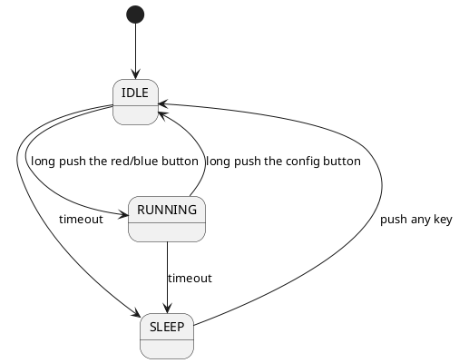

# 乒乓球微型积分器

## 需求概述

  球类运动中， 特别是乒乓球， 羽毛球等， 练习或者玩耍的时候需要计分， 但很多非专业运动者需要在专心比赛的同时需要关注诸如：轮到谁发球， 目前小比分是多少， 大比分是多少， 比赛是否已结束。这对非专业选手来说并非容易， 且并无意义。 运动时可单手操作的可穿戴小设备是有意义的。

## 功能概述

* 比分显示：显示小比分和大比分
* 计小分功能： 需要有红色， 蓝色按钮， 按相应按钮， 给相应运动员加分
* 单局比赛完赛提醒： 比如乒乓球， 有一人已经得到11分或以上， 并且领先另一方2分以上， 可有蜂鸣提醒
* 计大分功能： 自动计大比分（并不提供完赛提醒功能）
* 自动标示目前发球方：设备需要能标识目前发球方
* 配置功能：进入某一配置界面， 允许使用者选择比赛类型：乒乓球， 羽毛球， （自定义类型）

## 功能解析

### 比分显示
* 大分显示在左侧， 小分显示在右侧
* 小分横向显示， 冒号隔开， 较大， 左侧表示蓝方选手
* 大分纵向显示， 较小， 上方表示蓝方选手

### 计小分功能
* 按蓝色按钮则冒号左侧分数+1， 按红色按钮则右侧分数+1

### 单局比赛完赛提醒
* 以乒乓球举例， 有一人得分已到达11分以上， 并且领先另一方2分以上， 蜂鸣提醒

### 计大分功能
* 以乒乓球举例， 当左侧小分达成胜利条件， 则大分区域上侧+1， 反之亦然

### 自动标识目前发球方
* 长按蓝色按钮， 比赛开始， 并且标志着蓝色方先发球
* 长安红色按钮， 比赛开始， 并且标志着红色方先发球
* 如果比赛已经开始， 无论长安红色或者蓝色， 都标志着比赛重新开始， 大小比分都清空

### 配置功能
* 提供一枚配置按钮， 当长按， 切换运动类型， 并且清空当前比分， 清空发球标记（相当于上电重启）

## 软件设计

### 场景状态

有三个状态， SLEEP, IDLE， RUNNING

* SLEEP : 省电模式
* IDEL: 比分清空， 发球标记清空， 显示当前运动模式
* RUNNING: 比赛中， 显示比分， 标记当前发球

### 各个模式下的事件

#### SLEEP 模式下
* 按任何键都进入IDLE模式

#### IDLE 模式下
* 屏幕显示当前运动类型
* 长按 red 进入 RUNNING， 所有比分清零， 发球标志落在red这一方
* 长按 blue 进入 RUNNING， 所有比分清零， 发球标志落在blue这一方
* 长按 config 跳到下一个运动类型
* 任何键都无输入30分钟后， 进入SLEEP模式

#### RUNNING 模式下
* 屏幕显示 大比分， 小比分
* 短按red， red 小分+1， 并且显示当前比分
* 短按blue， blue 小分+1， 并且显示当前比分
* 长按red， 清空当局比分， 发球标志落到red
* 长按blue， 当局比分， 发球标志落到blue
* 长按 config， 清空所有比分和发球标志， 进入IDLE状态
* 短按 config， 回溯之前一局的比分，所有之前局轮询完了后就回到显示当前比分 
* 任何键都无输入30分钟后， 进入SLEEP模式
* 发球标志轮换， 有一方在10分以下， 每两分换发球， 否则每一分换发球
* 小分大的一方小分大于等于11， 并且小分大的一方， 小分减去另一方的差大于等于2， 蜂鸣器响2秒， 并且对应大分+1